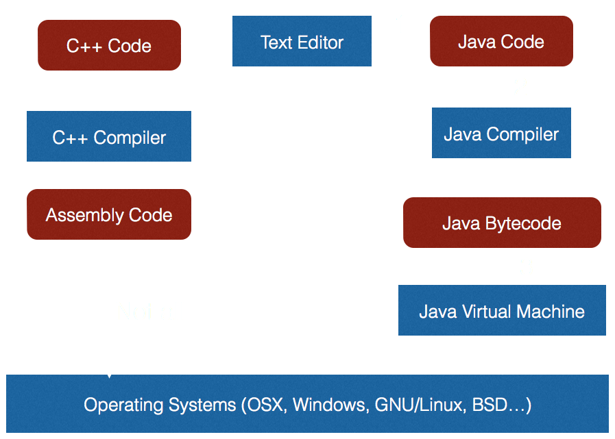

# Tutorial 1

### https://github.com/comp346/W15

---
# Objective

### Synchronization mechanism on Concurrent Programming using Java

---
# Concurrent vs Parallel


---
# What's Java ?

- Object Oriented Programming Language
- Imperative Language (vs Functional)
- Static & Strong type (vs Dynamic Type)
- Cross platform

---


---
# 1. Creating Java source code

- Using a text editor to create HelloWorld.java

```java
public class HelloWorld {
  public static void main(String[] args) {
    System.out.println("Hello World!");
  }
}
```

---
# 2. Compiling Java Source Code
- Launch terminal
- Run `javac HelloWorld.java` to compile
- Output is HelloWorld.class

---
# 3. Launching Java Application

- Run `java HelloWorld` to run the application
- HelloWorld is a public class which has an entrance 
- Application entrance `static void main` method

---
# Toolkits
- Free to choose operating system (**GNU/Linux, OSX**, Windows)
- IDEs : Intellij, Eclipse, Netbean
- Editors: Sublime Text, Vim, Emacs, Atom, ...

### Recommend to do assignment on your own machine
(Other TAs may require you demo on Lab's machines)

---
# Installation
1. Java Development Kit (Oracle JDK or OpenJDK)
2. IDEs or editors
3. Run HelloWorld by IDE

---
# Java Quick Started

---
# Application structure
- An application includes classes
- A class includes fields and methods 
- A method is composited by statements
- An application is started at **main entry**

---
# Class

- Fields are properties of instance
- Methods are behaviours
- Constructors are used to initialized instances
- Static vs Instance


---
# Method
- **Signature:** Method Type, Name, Return Type, Arguments
- **Body:** Statements


---
# Constructor
Special method to initialize instance of class

```java
class Student {
    private int id;
    private String name;
    public Student(int id, String name) {
        this.id = id;
        this.name = name;
    }
}
```

---
# Statements

- Declaration
- Assignment
- Conditional statements (if and switch)
- Invoking
- Loop statements (for, while, do while)
- Return statement

---
# Builtin Types


---
# Declaration & Assignment
```java
int x;
int y = 10;
String name = "Concordia University";
Student st = new Student(123, "Name"); //Create student with name and id
```

---
# Conditional Statement
```java
if (x < 10) {

}else {
    
}

//Comment line

if (x == 10) {
    
}
```

---
# Selection Statement
```java
switch(day) {
    case 0: System.out.println("Sun"); break;
    case 1: System.out.println("Mon"); break;
}
```

---
# Loop Statements
```java
for(int i = 0; i < N; i++) {

}

while(i < N) {
    i += 1;
}
```

---
# Return Statement

- Stops execution of method
- Returns value 

```java
public double maxWithoutElse(double d1, double d2) {
    if(d1 < d2) {
        return d2;
    }
    return d1;
}
```

---
# Assembling 

```java
class Mathematician {
    //Property
    private String name;
    
    //Constructor
    public Mathematician(String name) {
        this.name = name;
    }

    //Instance method
    public int calculateFactorial(int n) {
        int result = 1;
        for(int i = 2; i <= n; ++i) {
            result *= i;
        }
        return result;
    }
}
```

---
# Invoking it

```java
class MyApp {
  public static void main(String[] args) {
    int n = 5;
    Mathematician m = new Mathematician("Anonymous");
    int factorial = m.calculateFactorial(n);
    System.out.println("Methematican says: " + n + "! = " + factorial);
  }
}
```

---
# Arrays

```java
String[] weekend = { "Saturday", "Sunday" };
int[] grades = {1, 2, ,3, 4, 5, 6, 7, 8, 9, 10};
int g1 = grades[0];
```
- Indexing starts from **0**
- Multiple dimension array

---
# Recommendations
1. Digesting Java quickly
2. Using IDE to develop (learn its shortcut keys)
3. Be familiar with command line
4. Start using version control (git)

---
# Sources
1. http://introcs.cs.princeton.edu/java/11cheatsheet/images/built-in.png
2. http://joearms.github.io/images/con_and_par.jpg


