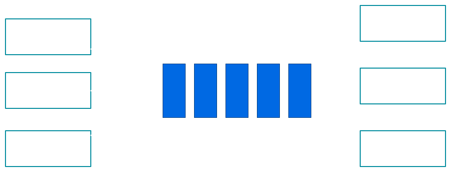

#[fit] Producer-consumer problem
---
# Producer-consumer
- Finite-size buffer
- Two classes of executions
1. **Producer**: Puts items to buffer
2. **Consumer**: Takes items out of buffer

---


---
# Advantages
- Decouple Producer & Consumer
- Mutiple producers & consumers

---
# Bounded Queue

---
```java
class BoundedQueue<E> {
  private Queue elements = new LinkedList()
  private final int MAX_SIZE = 10;
  public void put(E e) {
    //Acquire access then
    //If has space: 
    //  Put element, release access, notify & return
    //Otherwise:
    //  release access, waits and repeats
  }
  
  public E take() {
    //Acquire access then
    //If has element:
    //  Remove element, release access, notify & return
    //Otherwise:
    //  Release access, waits and repeats
  }
}
```

---
# Put
```java
public void put(E e) throws InterruptedException {
    synchronized(this) {
        while(elements.size() == MAX_SIZE){
            wait();
        }
        if(elements.isEmpty()) {
            notifyAll();
        }
        elements.add(e);
    }
}
```

---
# Take
```java
public E take() throws InterruptedException {
    synchronized(this) {
        while(elements.isEmpty()) {
            wait();
        }
        if(elements.size() == MAX_SIZE) {
            notifyAll();
        }
        return elements.remove();
    }
}
```

---
# Magic of wait()
---
# What wait() does?
1. Release access (ownership of this)
2. Waits until get notified
3. Acquires access (ownership of this)

---
# Wait() pattern
```java
synchronized (obj) {
    while (<condition does not hold>)
        obj.wait();
    // Perform action appropriate to condition
}
```

---
#[fit] Read tutorial slides #3 from Dr. Hanna


